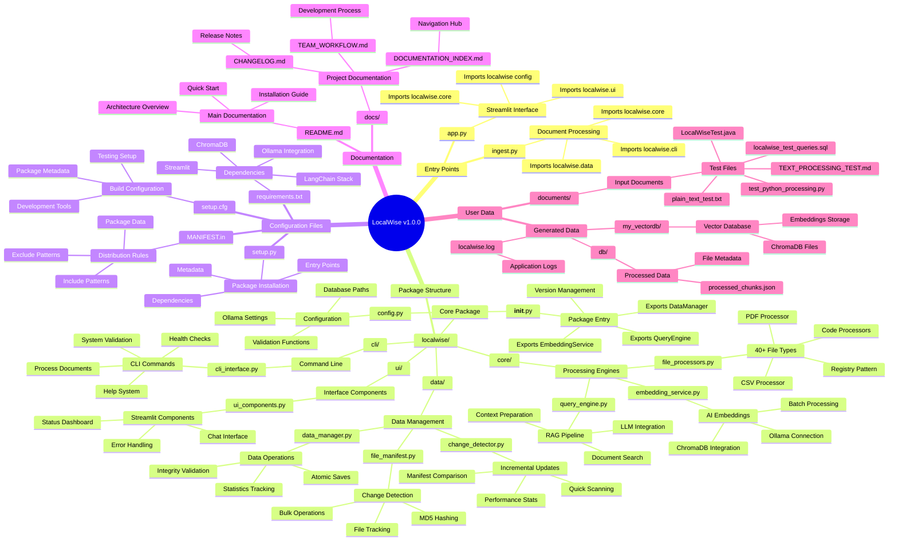

# LocalWise File Interaction Mindmap

This Mermaid mindmap diagram shows the complete file structure and interactions within the LocalWise v1.0.0 project.

## Diagram

## Key Interactions

### Entry Points Flow
1. **app.py** → Streamlit web interface → imports `localwise.ui`, `localwise.core`
2. **ingest.py** → Document processing → imports `localwise.core`, `localwise.data`, `localwise.cli`

### Core Package Dependencies
- **localwise/__init__.py** → Central package entry, exports main classes
- **localwise/config.py** → Configuration used by all modules
- **Core engines** process documents and handle AI operations
- **Data layer** manages persistence and change detection
- **UI/CLI** provide user interfaces

### Data Flow
1. **documents/** → **file_processors.py** → **data_manager.py** → **db/**
2. **db/** → **embedding_service.py** → **my_vectordb/**
3. **User query** → **query_engine.py** → **my_vectordb/** → **Response**

### Configuration Management
- **setup.py, requirements.txt** → Package installation and dependencies
- **MANIFEST.in** → Distribution rules
- **setup.cfg** → Build configuration

This mindmap provides a comprehensive view of how all LocalWise components interact and depend on each other.